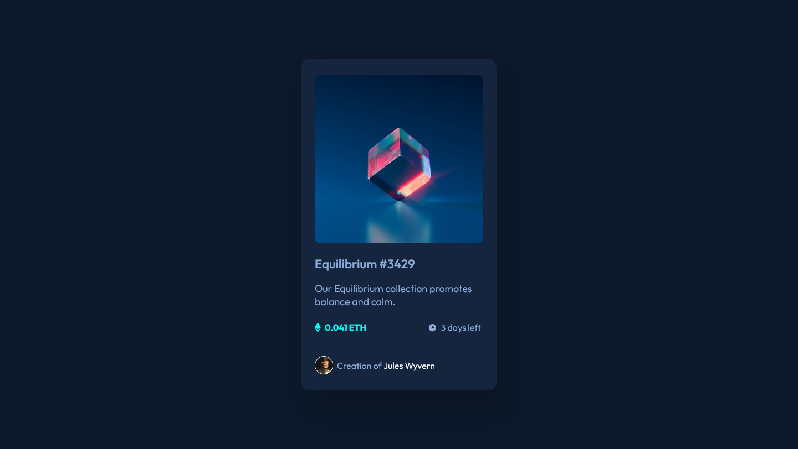
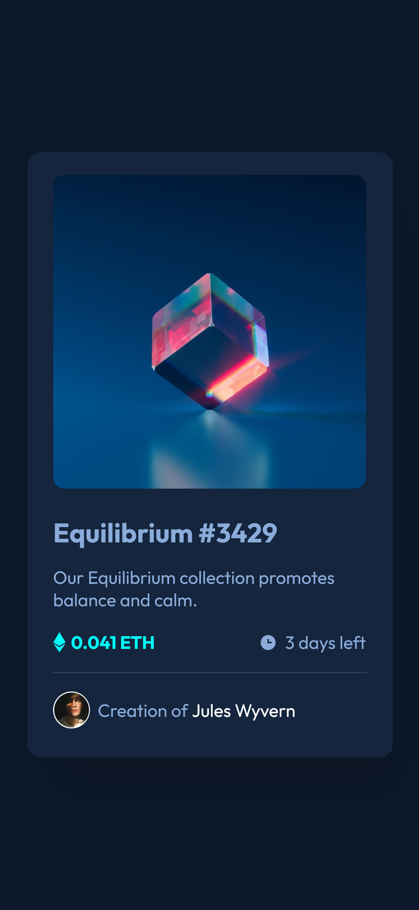

# Frontend Mentor - NFT preview card component solution

This is a solution to the [NFT preview card component challenge on Frontend Mentor](https://www.frontendmentor.io/challenges/nft-preview-card-component-SbdUL_w0U). Frontend Mentor challenges help you improve your coding skills by building realistic projects. 

## Table of contents

- [Overview](#overview)
  - [The challenge](#the-challenge)
  - [Screenshot](#screenshot)
  - [Links](#links)
- [My process](#my-process)
  - [Built with](#built-with)
  - [What I learned](#what-i-learned)
  - [Continued development](#continued-development)
  - [Useful resources](#useful-resources)
- [Author](#author)
- [Acknowledgments](#acknowledgments)

## Overview

### The challenge

Users should be able to:

- View the optimal layout depending on their device's screen size
- See hover states for interactive elements

### Screenshot

### Links

- Solution URL: [Add solution URL here](https://github.com/tchydy/nft-preview-card-component-main)
- Live Site URL: [Add live site URL here](https://tchydy.github.io/nft-preview-card-component-main)

## My process

### Built with

- Semantic HTML5 markup
- CSS custom properties
- Flexbox
- Mobile-first workflow

**Note: These are just examples. Delete this note and replace the list above with your own choices**

### What I learned

- Use this to repeat what I have been learning and gain speed.

### Continued development

### Useful resources

- [active pseudo class](https://www.w3schools.com/cssref/sel_active.asp) - This helped me to have hover interactions for mobile using active pseudo class

## Author

- Frontend Mentor - [@tchydy](https://www.frontendmentor.io/profile/tchydy)

**Note: Delete this note and add/remove/edit lines above based on what links you'd like to share.**

## Acknowledgments

